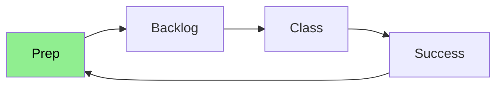
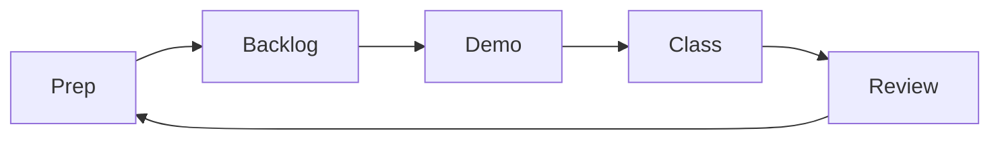

# 🤝 Welcome to your Onboarding Module

## 🔑 Do the prep

Before you try to complete the work in this repo, go to your curriculum and work through the prep. The prep shows you how to complete the work in this repo. Start with the prep.

Your workflow should always be:

### 🥁 Rhythm of the Week

Get into a rhythm of working through the coursework:

## 📅 Planning and managing your work

All the coursework is listed as issues on this repo. These issues are mirrored on your curriculum backlog page.

You will copy these issues to your Coursework Planner, which is one repo that will hold all your coursework and assignments for the entire course.

If you do not already have your own Coursework Planner, set one up now:

https://github.com/CodeYourFuture/Coursework-Planner
